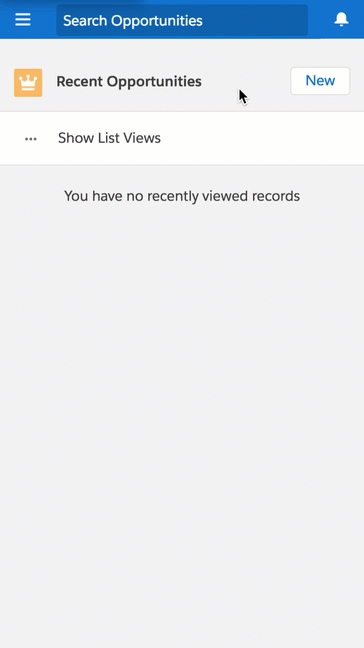
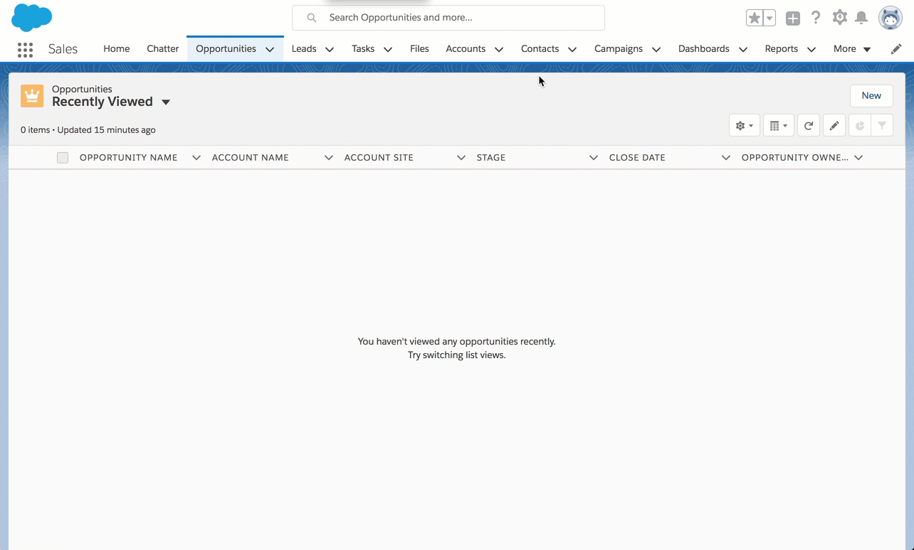

# Overview

This is a quick demo of how to create a record, while defaulting values (instead of using the infamous URL Hack)

**Please note: sample code (metadata api and dx formats) are available in the [mdapi](./mdapi) and [dx](./dx) folders above**

# Lightning Action Demo

We want to create an Opportunity off a contact (defaulting specific values on create)

Instead of using the infamous URL Hacks, we want a better way. That is supported, but also declarative.

In this case, if we create an Opportunity off the 'new opportunity' button, we see there is nothing defaulted.

But if we create the Opportunity off a Contact using a Quick Action, we can default information off the current Contact (name, but also advanced information or Custom Settings and other logic)

All of this is configurable, even with its own layout to only request info that is actually needed.

Using Default Values on the Quick Action, you can define the values to use in a similar way to defining formula fields - even fields not shown.

That works in all environments (Classic/LEX/SF1/etc)

[Quick Actions](https://trailhead.salesforce.com/modules/lex_javascript_button_migration/units/javascript_button_alternatives) let us do just that.

*(Note: it may be called Publisher Actions in some areas depending on context)*

We can create records, and pre-define the values to be passed (even if they aren't shown in the layout)
in a way that works in all environments.

It also allows for configurable 'short forms',
so we can enter only the info we need and get on with our day.

**Please see BELOW for more detail**

----

# Install Demo via Salesforce CLI

This assumes you have already installed the [Salesforce CLI]() and [Connected the Salesforce CLI to your org](https://developer.salesforce.com/docs/atlas.en-us.sfdx_dev.meta/sfdx_dev/sfdx_dev_auth_web_flow.htm).

However, the Salesforce CLI can be used with any org and does not require Salesforce DX to be enabled. (Although enabling the DX / Dev Hub would give some great benefits, and would only require care of [certain object permissions: Scratch Org Info, ActiveScratchOrg, NamespaceRegistry](https://developer.salesforce.com/docs/atlas.en-us.sfdx_setup.meta/sfdx_setup/sfdx_setup_add_users.htm) - as they are not available in all orgs)

**1.** Run the following command:

	sfdx force:source:push -u [[orgAlias]]

**2.** Add the permission set to your user

	sfdx force:user:permset:assign -n URLHackerAvoider -u [[orgAlias]]
	
**3.** Upload the data

	# create the Opportunity Settings Custom Setting
	# (Custom Metadata is Better, but plays different)
	sfdx force:data:tree:import -f ../data/tree/OpportunitySettings__c.json -u [[orgAlias]]
	
	# create dinoco account and Bob Parr contact
	sfdx force:data:tree:import -p ../data/trees/Account-Contact-plan.json -u [[orgAlias]]
	
...

Thats it, you can now open the org, and find the 'ticket' object in the 'all tabs' search.

	sfdx force:org:open -u [[orgAlias]]

---

# Quick Action How-To

To create a Quick Action (Publisher Action):

* Create a [Quick Actions](https://trailhead.salesforce.com/modules/lex_javascript_button_migration/units/javascript_button_alternatives) from Parent
* Specify the `Predefined Field Values` through formulas
* Specify the Form layout
* Add the Quick Action to the Parent page layout.

Please see the [Quick Action Considerations](https://help.salesforce.com/articleView?id=actions_considerations.htm&type=5) for limitations.

.

.

.

.

-----

# List Button Demo

There may be times that we don't want a Publisher action, and want to enter directly off the related list.

In this case, [Visualforce List Buttons](https://trailhead.salesforce.com/modules/lex_javascript_button_migration/units/javascript_button_alternatives) would be needed as they are supported in List Views.

(as Quick Actions and Lightning Actions are note supported in List Views) 

In this case, we can create a [Visualforce Page using Lightning Design System](https://trailhead.salesforce.com/en/projects/workshop-lightning-design-system-visualforce)

that can dispatch Lightning Events using [sforce.one.createRecord](https://developer.salesforce.com/docs/atlas.en-us.salesforce1.meta/salesforce1/salesforce1_dev_jsapi_sforce_one.htm) - defaulting values with the defaultFieldValues parameter.

But we must be aware: there are caveats to support in various environments.

** Please see BELOW for more detail **

----

# Install Demo via Salesforce CLI

This assumes you have already installed the [Salesforce CLI]() and [Connected the Salesforce CLI to your org](https://developer.salesforce.com/docs/atlas.en-us.sfdx_dev.meta/sfdx_dev/sfdx_dev_auth_web_flow.htm).

However, the Salesforce CLI can be used with any org and does not require Salesforce DX to be enabled. (Although enabling the DX / Dev Hub would give some great benefits, and would only require care of [certain object permissions: Scratch Org Info, ActiveScratchOrg, NamespaceRegistry](https://developer.salesforce.com/docs/atlas.en-us.sfdx_setup.meta/sfdx_setup/sfdx_setup_add_users.htm) - as they are not available in all orgs)

**1.** Run the following command:

	sfdx force:source:push -u [[orgAlias]]

**2.** Add the permission set to your user

	sfdx force:user:permset:assign -n URLHackerAvoider -u [[orgAlias]]
	
**3.** Upload the data

	# create the Opportunity Settings Custom Setting
	# (Custom Metadata is Better, but plays different)
	sfdx force:data:tree:import -f ../data/tree/OpportunitySettings__c.json -u [[orgAlias]]
	
	# create dinoco account and Bob Parr contact
	sfdx force:data:tree:import -p ../data/trees/Account-Contact-plan.json -u [[orgAlias]]
	
...

Thats it, you can now open the org, and find the 'ticket' object in the 'all tabs' search.

	sfdx force:org:open -u [[orgAlias]]

---

# List Button How-To

[Visualforce List Buttons](https://trailhead.salesforce.com/modules/lex_javascript_button_migration/units/javascript_button_alternatives) differ from Quick Actions in that they use the record Page Layout, instead of a form specific for the action, and so Page Layout assignments are honored.

## List Button Definition

As described further in [JavaScript Button Alternatives](https://trailhead.salesforce.com/modules/lex_javascript_button_migration/units/javascript_button_alternatives), create the List View button and direct it to Visualforce (so it can be supported in more Lightning contexts)

## VF Controller Definition

Using the StandardSetController, we can determine the originating record (Parent) to create the record from.

We then determine the values to pass as default field values.
	    
    /** Constructor **/
    public LightningEventFromVF_C( ApexPages.StandardSetController controller ){
        
        //-- get the context from the originating Parent Account
        Map<String,String> params = new Map<String,String>();
        params = ApexPages.currentPage().getParameters();
	
        String contactId = params.get('id');
        this.contactInfo = new Contact();
        
        try {
            this.contactInfo = [SELECT Id, Name, AccountId, SourceSystem__c
                FROM Contact
                WHERE Id = :contactId
                LIMIT 1
            ];
        } catch(Exception err){
            System.debug('exception when finding contact');
            System.debug(err);
        }
        
        ...
    }
    
    
## Visualforce Page Definition

Within the Visualforce Page, we should leverage the similar type of styles from the container (Service, Sales, LEX, SalesForce1, etc)

	<!--
	/**
	 * VisualForce page that publishes a lightning action
	 */
	-->
	<apex:page standardController="Opportunity" extensions="LightningEventFromVF_C"
	    recordSetVar="opportunities"
	    standardStylesheets="false" showHeader="false" sidebar="false"
	    applyHtmlTag="false" applyBodyTag="false" docType="html-5.0"
	>
	    <!-- <apex:includeLightning /> -->
	    
	    <!-- include Lightning Design System for style parity -->
	    <apex:slds />
	    
	    

	        
	        <!--
	        example spinner if desired
	        

	            Loading
	            

	            

	        

	        -->
	        
	        <!--
	        There is no current callback on createRecord completion.
	        However, sforce.one supports redirection back to the original page.
	        
	        Please see here for more detail:
	        https://developer.salesforce.com/docs/atlas.en-us.salesforce1.meta/salesforce1/salesforce1_dev_jsapi_sforce_one.htm
	        -->
	        <button class='slds-button slds-button--neutral slds-button--brand'
	            onclick='javascript:sforce.one.back();false;'
	        >
	            Back
	        </button>
	    

	    
	    ...
	</apex:page>
	
----
	
We can then expose those default values using [sforce.one.createRecord](https://developer.salesforce.com/docs/atlas.en-us.salesforce1.meta/salesforce1/salesforce1_dev_jsapi_sforce_one.htm)
    
    
