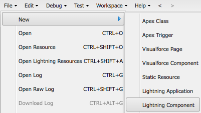

# Overview

This is a quick demo of how to create a record, while defaulting values (instead of using the infamous URL Hack)

I want to create an object and default values - quickly and efficiently.
(Preferrably using page layouts).

---

We provide a description in three main areas:

* [Quick Actions](#quick-action-demo) - the standard to create children off a parent
* [Lightning Actions](#lightning-action-demo) - a more powerful way to create children - using a bit more code
* [List Buttons](#list-button-demo) - How to create children off a List View.

Please see the [Install](#install) section below on how to install the demo.

.

.

.

# Quick Action Demo

Quick Actions are the standard for how to create child records off of a parent record.

.

.

.

It works well in desktop as-well as mobile:

.

.

.

And uses a declarative (clicks-not-code) way of showing only the fields you need, and defaulting the values of the new object (even if they aren't presented).

For more information, please see:
[Quick Actions](https://trailhead.salesforce.com/modules/lex_javascript_button_migration/units/javascript_button_alternatives)

**Please see BELOW for more detail**

---

# Quick Action How-To

To create a Quick Action (Publisher Action):

* Create a [Quick Actions](https://trailhead.salesforce.com/en/modules/salesforce1_mobile_app/units/salesforce1_mobile_app_actions_objectspecific) from the object where the button should be (parent)
* Specify the `Predefined Field Values` through formulas
* Specify the Form layout
* Add the Quick Action to the Parent page layout.

Please see the [Create Object-Specific Quick Actions - Trailhead Module](https://trailhead.salesforce.com/en/modules/salesforce1_mobile_app/units/salesforce1_mobile_app_actions_objectspecific) for more information.

Please see the [Quick Action Considerations](https://help.salesforce.com/articleView?id=actions_considerations.htm&type=5) for limitations.
.

.

.

.

# Lightning Action Demo

Lightning Actions can be customized to work just as well (if not better) than Quick Actions - but do require custom code.

.

.

It works well in Desktop and in Salesforce1.

.

.

Unlike Quick Actions, it can take you directly to the child record created (so you do not need to navigate to the related list - saving clicks) and also can use the standard page layout of the object - similar to List Views.

.

.

Yet, unlike List View buttons, cancels work as you'd expect - you remain on the existing page.

**Please see BELOW for more detail**

---

# Lightning Action How-To

## High Level Approach

To create a Lightning Quick Action we need three things:

#### Lightning Controller

A Lightning Controller to retrieve the information to be used as default.

**Note: it is possible in some cases to use the [Lightning Data Service](https://trailhead.salesforce.com/en/modules/lightning_data_service) - but there are some calculated things that will require some form of Apex Controller (at least at the time this was written)

For example:

* Record Type Ids
* Custom Settings
* Custom Metadata
* etc.

A single [Server Side Action](https://developer.salesforce.com/docs/atlas.en-us.lightning.meta/lightning/controllers_server_actions_call.htm) can return a custom object with all relevant information (also helping to reduce the bar for newcomers)

#### Lightning Component

A simple lightning component can then retrieve that data and then call a [force:createRecord lightning event](https://developer.salesforce.com/docs/atlas.en-us.lightning.meta/lightning/ref_force_createRecord.htm)

As-well as a [closeQuickAction Lightning Event](https://developer.salesforce.com/docs/atlas.en-us.lightning.meta/lightning/ref_force_closeQuickAction.htm?search_text=closeQuickAction) to close our component and make way for the standard creation modal.

#### Lightning Action using the Lightning Component

Finally, we'll need a Lightning Action to use the lightning Component.

## Template files

Please also see the template files for creating new:

All sections to be changed are marked with @CHANGE

#### Create an Apex Class for the Controller

Open the Developer Console (so that we can create a new Apex Class)

Then select File > New > Apex Class

Then copy and paste the code from the [Lightning Action Controller template code](CodeTemplates/LightningAction/ComponentController/ltng_URLHackComponentCtrl.cls)

Note the `@CHANGE` sections and make the appropriate changes.

<table><tr><th>Placeholder</th><th>Description</th><th>Example</th></tr>
<tr><td colspan='3'><b>Change 1 - Retrieve the base object info - to use for default values</b></td></tr>
<tr><td>YOUR_BASE_SOBJECT_API_NAME__c</td><td>the API Name of the base SObject</td><td>ex: Account or CustomObject__c</td></tr>
<tr><td>YOUR_FIELD_API_NAME__c</td><td>the API Names of the fields to retrieve</td><td>ex: CustomField__c</td></tr>
<tr><td colspan='3'><b>Change 2 - Determine the RecordTypeId to use for the new object</b></td></tr>
<tr><td>NEW_OBJECT_API_NAME__c</td><td>the API Name of SObject the new record should be</td><td>ex: Opportunity, or ChildObject__c</td></tr>
<tr><td>YOUR_RECORDTYPE_NAME</td><td>the NAME of the record type to use</td><td>ex: Extended or FieldService</td></tr>
<tr><td colspan='3'><b>Change 3 - create @AuraEnabled public properties for the info to be used in defaulting</b></td></tr>
<tr><td>YOUR_BASE_SOBJECT_API_NAME__c</td><td>the API Name of the base SObject</td><td>ex: Account or CustomObject__c</td></tr>
<tr><td>Any Other Properties</td><td>Using a similar definition, other properties</td><td>@AuraEnabled   public String userLastName;</td></tr>
</table>

#### Create a new Lightning Component

Within the Developer Console...

Select File > New > Lightning Component

Enter in a name for the component (without spaces), and apply a description.

**The component must be available within the Quick Action, but the template file below specifies this for you**

#### Fill in the Component File

Copy and paste the code from the [Lightning Component File](CodeTemplates/LightningAction/LightningComponent/ltng_URLHackComponent.cmp)

Address any sections that have `@CHANGE.`   (At the time of this writing there is none)

#### Fill in the Component Controller

Then select `Controller` and paste the code from [Lightning Component Controller](CodeTemplates/LightningAction/LightningComponent/ltng_URLHackComponentController.js)

Address any sections that have `@CHANGE`.   (At the time of this writing there is none)

#### Fill in the Component Helper

Then select `Helper` and paste the code from [Lightning Component Helper](CodeTemplates/LightningAction/LightningComponent/ltng_URLHackComponentHelper.js)

Address any sections that have `@CHANGE`, and make the appropriate changes.

<table><tr><th>Placeholder</th><th>Description</th><th>Example</th></tr>
<tr><td colspan='3'><b>Change 1 - get the fields from the base object</b></td></tr>
<tr><td>Any other defaults</td><td>Add any additional fields to use for defaults</td><td>var userLastName = resultValue.userLastName;</td></tr>
<tr><td colspan='3'><b>Change 2 - default the values</b></td></tr>
<tr><td>NEW_SOBJECT_API_NAME__c</td><td>the API Name of the type of object to create</td><td>ex: Account, CustomObject__c</td></tr>
<tr><td>TARGET_RECORD_TYPE</td><td>the NAME of the RecordType to use when creating the new record</td><td>ex: Extended or FieldService</td></tr>
<tr><td>FIELD_TO_DEFAULT_API_NAME__c</td><td>the API name of the field to default</td><td>ex: Name or CustomDescription__c</td></tr>
<tr><td>DEFAULT_VALUE</td><td>the value to default</td><td>the variable from above</td></tr>
</table>

#### Finally - Create a New Action

To create a new Action, open `Setup` under the Gear at the top-right of Lightning Experience.

Then select `Object Manager` and select the Base SObject (you will create the new record FROM)

Then Select `Buttons, Links and Actions`, and specify `New Action`

Specify that we will use a Lightning Component,  
and specify the Lightning Component we just made.

Define the height of the initial window  
but can be left to 250px, as this is only for the loading spinner in our case.

Specify the Label of the button (what you will see to select the button)
and the unique API Name of the button (with an optional Description) 

**Don't forget to add the button to your Page Layout**

The entire component can be found [under Lightning Component Template files - for reference](CodeTemplates/LightningAction)

## Detailed Approach

To make a Lightning Action version of a URL Hack, we need three things:

* An [Apex Controller](#la-apex-controller)
* A [Lightning Component](#la-lightning-component)
* A [Lightning Action](#la-lightning-action)

## LA Apex Controller

The Apex Controller simply provides the [Server Side Action](https://developer.salesforce.com/docs/atlas.en-us.lightning.meta/lightning/controllers_server_actions_call.htm) for the Lightning Component.

Here is the outline for the class.

	/**
	 * Controller for for the ltng_URLHackComponent Lightning Component.
	 */
	public with sharing class ltng_URLHackComponentCtrl {
		
		/**
		 * Determines the list of default values to use
		 * when creating the child record.
		 * @param baseRecordId (Id)
		 * @return UrlHackDefaultValues - custom object that contains everything it needs.
		 */
		@AuraEnabled
		public static UrlHackDefaultValues getUrlHackDefaultValues(Id baseRecordId){
	
			UrlHackDefaultValues results = new UrlHackDefaultValues();
	
			//-- UPDATE THE LINES BELOW
			//--	-	-	-	-	-	-	-	-	-	-	-
			... retrieve values to use for defaulting
			results.currentUserLastName = UserInfo.getLastName();
			...
			//--	-	-	-	-	-	-	-	-	-	-	-
			//-- UPDATE THE LINES ABOVE    
			
			return results;
		}
	
		public class UrlHackDefaultValues {
			
			//-- UPDATE THE LINES BELOW
			//--	-	-	-	-	-	-	-	-	-	-	-
			... properties
	
			@AuraEnabled
			public String childRecordTypeId;
			//--	-	-	-	-	-	-	-	-	-	-	-
			//-- UPDATE THE LINES ABOVE        
		}
	}

Here we simply require an @AuraEnabled method (that requires public class / method

That returns a local class with the attributes to share back with the Lightning Component marked as public @AuraEnabled properties.

#### Retrieve the Data

We retrieve the data and simply store it on the attributes of the custom class to be returned.

        //-- get the base object info
        try {
            results.baseInfo = [
                SELECT Id, Name, CustomDescription__c,
                    SampleCheckbox__c, SampleDate__c, SampleNumber__c,
                    SamplePicklist__c
                FROM ltng_UrlHackBase__c
                WHERE Id = :baseRecordId
                LIMIT 1
            ];
        } catch(Exception err){
            System.debug('exception when fetching the base record');
            System.debug(err);
        }

[See Implementation](dx/force-app/main/default/classes/ltng_URLHackComponentCtrl.cls#L17)

#### Serialize and Return

Any attributes marked with [@AuraEnabled are serialized for return to the lightning component](https://developer.salesforce.com/docs/atlas.en-us.212.0.lightning.meta/lightning/controllers_server_apex_auraenabled_annotation.htm?search_text=auraenabled)

        /** base info you want to return **/
        @AuraEnabled
        public ltng_URLHackBase__c baseInfo;

[See Implementation](dx/force-app/main/default/classes/ltng_URLHackComponentCtrl.cls#L75)

## LA Lightning Component

The lightning component doesn't really do much. That is more left to the controller (to retrieve the value and send it)

	<!--
	/**
	 * Component that performs similar to a URL Hack (from a Lightning Action)
	 * 
	 * 
Note: the loading of the data is done in the
	 *   associated controller: ltng_URLHackComponentCtrl

	 * 
	 * @component: ltng_URLHackComponent
	 **/
	-->
	<aura:component
		controller="ltng_URLHackComponentCtrl"
		implements="force:hasRecordId,flexipage:availableForAllPageTypes,flexipage:availableForRecordHome,force:hasRecordId,force:lightningQuickAction"
		access="global"
	>
		<!-- note: it must implement force:hasRecordId
			so the recordId attribute is automatically filled -->
		<!-- attributes -->
		<!-- automatically provided because we implement force:hasRecordId -->
		<aura:attribute name="recordId" type="String" />
		<!-- handlers -->
		<aura:handler name="init" value="{!this}" action="{!c.init}" />
		<!-- data -->
		<!-- events -->
		<!-- elements -->
		<!-- show a spinner while everything loads -->
		

			Loading...
			

			

		

	</aura:component>
	
**Please note, that the `force:hasRecordId` helps in this case, it automatically populates the `recordId` attribute - so we can retrieve its data**

The second most important part is that it must call the `init` method on the controller:

    <!-- handlers -->
    <aura:handler name="init" value="{!this}" action="{!c.init}" />

## Controller

This also, doesn't need to change much, as it simply calls the controller's method to get the default values.

	({
		/**
		 * Initialization method
		 */
		init : function(component, event, helper) {
			//-- please note: we are only retrieving the base info in this example.
			//-- if we want to retrieve more data, then we would need other means.
	
			var recordTypeId = component.get("v.recordId");
	
			//-- get the default values
			var action = component.get("c.getUrlHackDefaultValues");
			action.setParams({
				"baseRecordId": recordTypeId
			});
			action.setCallback(this, function(response){
				var state = response.getState();
				if( state !== "SUCCESS" ){
					console.error("error occurred");
					debugger;
					return;
				}
	
				var resultValue = response.getReturnValue();
	
				helper.handleDefaultValues(resultValue, component, helper);
			});
			$A.enqueueAction(action);
		}
	})

See [Calling Server Side Actions](https://developer.salesforce.com/docs/atlas.en-us.lightning.meta/lightning/controllers_server_actions_call.htm) for more on how to call @AuraEnabled methods on Apex Controllers.

If the response is helpful, it then calls the Helper (the sharable code section - where we will need some slight customization)

## Helper

#### outline

The Helper has three methods, and only one that is specific to what we are doing:

* handleDefaultValues - this is the item that changes as it takes the defaults and creates the record
* closeWindow - standard function to close our lightning component - to make way for the edit window
* displayError - standard function to show any error messages

The outline of the file is below:

	({
		/**
		 * handles when all the default values are received
		 */
		handleDefaultValues : function(resultValue, component, helper){
			console.info('default values retrieved');
	
			//--	-	-	-	-	-	-	-	-	-	-	-
			//-- UPDATE THE LINES BELOW
			//--	-	-	-	-	-	-	-	-	-	-	-
			... set default values
			... call createRecord Lightning Event
			//--	-	-	-	-	-	-	-	-	-	-	-
			//-- UPDATE THE LINES ABOVE
			//--	-	-	-	-	-	-	-	-	-	-	-
	
			createRecordEvent.fire();
	
			helper.closeWindow();
		},
	
		/**
		 * Closes the modal window
		 */
		closeWindow : function(){
			$A.get("e.force:closeQuickAction").fire()
		},
	
		/**
		 * Displays an error
		 * @param errorTitle (String)
		 * @param errorMsg (String)
		 **/
		displayError: function(errorCode, component, event, helper){
			var errorTitle = 'Error';
			var errorMsg = 'An error occurred: ' + errorCode + '. Please contact your System Administrator';
			
			//-- send a toast message
			var resultsToast = $A.get('e.force:showToast');
			resultsToast.setParams({
				'title': errorTitle,
				'message': errorMsg
			});
			resultsToast.fire();
		},
	})

#### Handle Default Values
	
The main meat of our work is `handleDefaultValues`.

First we retrieve the values to default (using those already returned from the @AuraEnabled method)

        //--	-	-	-	-	-	-	-	-	-	-	-
        //-- UPDATE THE LINES BELOW
        //--	-	-	-	-	-	-	-	-	-	-	-
		
		//-- determine the values to use for defaulting
		var recordTypeId = resultValue.childRecordTypeId;
		var baseRecordId = resultValue.baseInfo.Id;
		var childName = resultValue.baseInfo.Name + ' Child';
		var childDescription = resultValue.baseInfo.CustomDescription__c;
		var childCheckbox = resultValue.baseInfo.SampleCheckbox__c;
		var childDate = resultValue.baseInfo.SampleDate__c;
		var childNumber = resultValue.baseInfo.SampleNumber__c;
		var childPicklist = resultValue.baseInfo.SamplePicklist__c;
		var createdByUserLastName = resultValue.currentUserLastName;
		var customSettingValue = resultValue.customMetadataInfo.MetadataValue__c;
		var customMetadataValue = resultValue.customSettingInfo.CustomSettingValue__c;

We then call createRecord using those defaults

		//-- call force:createRecord
		//-- see here for more info https://developer.salesforce.com/docs/atlas.en-us.lightning.meta/lightning/ref_force_createRecord.htm
		//-- createRecordEvent.setParams({
		//-- 	'entityApiName': 'SObject_Name',
		//--	'recordTypeId': RECORD_TYPE_OF_THE_OBJECT_TO_CREATE,
		//--	'defaultFieldValues': {
		//--		'FieldApi__c': defaultValue
		//--		...
		//--	}
		//-- })

		var createRecordEvent = $A.get("e.force:createRecord");
		createRecordEvent.setParams({
			'entityApiName': 'ltng_URLHackChild__c',
			'recordTypeId': recordTypeId,
			'defaultFieldValues': {
				'URLHackBase__c': baseRecordId,
				'Name': childName,
				'CustomDescription__c': childDescription,
				'CreatedByUserLastName__c': createdByUserLastName,
				'CustomSettingValue__c': customSettingValue,
				'CustomMetadataValue__c': customMetadataValue,
				'SampleCheckbox__c': childCheckbox,
				'SampleNumber__c': childNumber,
				'SampleDate__c': childDate,
				'SamplePicklist__c': childPicklist
			}
		});
		//--	-	-	-	-	-	-	-	-	-	-	-
		//-- UPDATE THE LINES ABOVE
		//--	-	-	-	-	-	-	-	-	-	-	-

Finally, we fire the event and close our component

		createRecordEvent.fire();

		helper.closeWindow();

## LA Lightning Action

Now we have our Lightning Component completed, we just need a Lightning Action (on our Parent record) to display our Lightning Component.

----

.

.

.

.

-----

# List Button Demo

There may be times that we want the button off the related list.

Currently, this can only be done through a VisualForce page related list button.

**Please Note: Generally this is not recommended, as certain cases are not well covered, such as there is no handler for a cancelled create. Leaving the user with a Lightning Button - to return... This does not happen with either the QuickActions or Lightning Actions.**
	

# List Button How-To

## High Level Approach

In this case, [Visualforce List Buttons](https://trailhead.salesforce.com/modules/lex_javascript_button_migration/units/javascript_button_alternatives) would be needed as they are supported in List Views.

(Quick Actions and Lightning Actions are not supported in List Views)

In this case, we need a VisualForce Page and Controller.

The controller simply retrieves all the information needed for defaulting (the base object, etc.) and stores it so the page can access.

The VisualForce page then does two things:

* [It uses the Lightning Design System](https://trailhead.salesforce.com/en/projects/workshop-lightning-design-system-visualforce) to show a loading spinner / and back button.
* It also dispatches Lightning Events using [sforce.one.createRecord](https://developer.salesforce.com/docs/atlas.en-us.salesforce1.meta/salesforce1/salesforce1_dev_jsapi_sforce_one.htm) - defaulting values with the defaultFieldValues parameter.

**Please see BELOW for more detail**

## Template files

Please also see the template files for creating new:

All sections to be changed are marked with @CHANGE

#### Create an Apex Class for the Controller

Open the Developer Console (so that we can create a new Apex Class)

Then select File > New > Apex Class

Then copy and paste the code from the [Lightning Action Controller template code](CodeTemplates/ListButton/PageController/ltng_UrlHackListButtonCtrl.cls)

Note the `@CHANGE` sections and make the appropriate changes.

@TODO: link the changes to specific sections in github repo

<table><tr><th>Placeholder</th><th>Description</th><th>Example</th></tr>
<tr><td colspan='3'><b>Change 1 - Retrieve the base object info - to use for default values</b></td></tr>
<tr><td>YOUR_BASE_SOBJECT_API_NAME__c</td><td>the API Name of the base SObject</td><td>ex: Account or CustomObject__c</td></tr>
<tr><td>YOUR_FIELD_API_NAME__c</td><td>the API Names of the fields to retrieve</td><td>ex: CustomField__c</td></tr>
<tr><td colspan='3'><b>Change 2 - Determine the RecordTypeId to use for the new object</b></td></tr>
<tr><td>NEW_OBJECT_API_NAME__c</td><td>the API Name of SObject the new record should be</td><td>ex: Opportunity, or ChildObject__c</td></tr>
<tr><td>YOUR_RECORDTYPE_NAME</td><td>the NAME of the record type to use</td><td>ex: Extended or FieldService</td></tr>
<tr><td colspan='3'><b>Change 3 - create @AuraEnabled public properties for the info to be used in defaulting</b></td></tr>
<tr><td>YOUR_BASE_SOBJECT_API_NAME__c</td><td>the API Name of the base SObject</td><td>ex: Account or CustomObject__c</td></tr>
<tr><td>Any Other Properties</td><td>Using a similar definition, other properties</td><td>public String userLastName;</td></tr>
</table>

### Create the VisualForce Page

The VisualForce page uses the information from the controller, to tell lightning how to create the object.

Within the Developer Console, create a new Visualforce Page through:  
File > New > VisualForce Page

Copy and paste the code from the [URL Hack List Button VisualForce page Template ](CodeTemplates/ListButton/VisualForcePage/ltng_UrlHackListButton.page)

Address any sections that have `@CHANGE`, and make the appropriate changes.

<table><tr><th>Placeholder</th><th>Description</th><th>Example</th></tr>
<tr><td colspan='3'><b>Change 1 - </b></td></tr>
<tr><td>NEW_OBJECT_API_NAME__c</td><td> type of SObject (API Name) we want to create - for the new object</td><td>ex: Opportunity, or ChildObject__c</td></tr>
<tr><td colspan='3'><b>Change 2 - get the fields from the base object</b></td></tr>
<tr><td>NEW_OBJECT_API_NAME__c</td><td> type of SObject (API Name) we want to create - for the new object</td><td>ex: Opportunity, or ChildObject__c</td></tr>
<tr><td>Any other defaults</td><td>Add any additional fields to use for defaults</td><td>var userLastName = resultValue.userLastName;  More listed below in the template</td></tr>
<tr><td colspan='3'><b>Change 3 - default the values</b></td></tr>
<tr><td>FIELD_TO_DEFAULT_API_NAME__c</td><td>the API name of the field to default</td><td>ex: Name or CustomDescription__c</td></tr>
<tr><td>DEFAULT_VALUE</td><td>the value to default</td><td>the variable from above</td></tr>
</table>

#### Finally, create the List View Button

To create a new List View button, open `Setup` under the Gear at the top-right of Lightning Experience.

Select `Object Manager` and navigate to the type of Object to be created.

Then Select `Buttons, Links and Actions`, and specify `New Button or Link`

Specify the Label of the button (what you will see to select the button)
and the unique API Name of the button (with an optional Description) 

Mark that the button will be a `List Button` (Uncheck `Display Checkboxes` - as we are not using any existing record)

Specify that we will `Display in Existing window with sidebar`, and the List Button Visualforce page we just created.

**Don't forget to add the button to your Page Layout**

The entire component can be found [under Lightning Component Template files - for reference](CodeTemplates/ListButton)

---

## Detailed Approach

To make a List View Button, we need three things:

* A [VisualForce Controller](#lb-vf-controller) (to load the defaults)
* A [VisualForce Page](#lb-visualforce-page) (to call the lightning event)
* A [List View Button](#lb-list-button) to expose the VisualForce Page

## LB VF Controller

The controller is quite simple, and only requires setup in two main areas:

* Retrieving the Data
* Setting properties to send the data to the VF Page.

.

Here is an outline of the page:

		/**
		 * Controller for VisualForce page that performs a 'URL Hack' from a List Button.
		 * 
Note the places to update with the UPDATE THE LINES ABOVE and UPDATE THE LINES BELOW

		 * @class ltng_UrlHackListButtonCtrl
		 **/
		public class ltng_UrlHackListButtonCtrl {
			
			//-- we only want a single property to store the serialized version of the results
			public String serializedDefaultValues {get;set;}
			
			/** Constructor **/
			public ltng_UrlHackListButtonCtrl( ApexPages.StandardSetController controller ){
				//-- get the context from the originating Parent Account
				Map<String,String> params = new Map<String,String>();
				params = ApexPages.currentPage().getParameters();
				
				//-- get the ID of the Base Record to pull from
				String baseRecordId = params.get('id');
				
				//-- place to store the results
				UrlHackDefaultValues results = new UrlHackDefaultValues();
				String serializedResults;
		
				//--	-	-	-	-	-	-	-	-	-	-	-
				//-- UPDATE THE LINES BELOW
				//--	-	-	-	-	-	-	-	-	-	-	-
				
				.... Retrieve the data
				.... and set them on the results
				
				//--	-	-	-	-	-	-	-	-	-	-	-
				//-- UPDATE THE LINES ABOVE
				//--	-	-	-	-	-	-	-	-	-	-	-
		
				this.serializedDefaultValues = JSON.serialize(results);
			}

			public class UrlHackDefaultValues {
				//--	-	-	-	-	-	-	-	-	-	-	-
				//-- UPDATE THE LINES BELOW
				//--	-	-	-	-	-	-	-	-	-	-	-
				
				... Result Properties to serialize.
						
				//--	-	-	-	-	-	-	-	-	-	-	-
				//-- UPDATE THE LINES ABOVE
				//--	-	-	-	-	-	-	-	-	-	-	-
			}
		}

One of the most important things is that we use the  StandardSetController, as this allows it to be used in List Buttons.

We then retrieve the Record Id.

Then retrieve the relevant data.

And then prepare it to be available in the VisualForce Page. (Here we serialize a local class to lower the bar, as these properties will then exist as-is in JavaScript on the VF Page).

#### Retrieve the Data

In this case, we simply use the `baseRecordId` sent (available from the params) and retrieve the record. 

If there is other information, like from custom settings or custom metadata, or from the user, we can get that too.

[Please see the implementation for an example](dx/force-app/main/default/classes/ltng_UrlHackListButtonCtrl.cls#L31)

#### Result Properties to Serialize

Any values we get, we then store on the local class.

	ex:
	public CustomSetting__c customSettingInfo;

so we can use `this.resultStr = JSON.serialize(results);`

[Please see the implementation for an example](dx/force-app/main/default/classes/ltng_UrlHackListButtonCtrl.cls#L105)

#### Serialize and return

Because these values are set on a local class, we can converted to JSON (so they can be used as JavaScript variables in the VF Page)

**Note: There is no issue with storing the objects outright as properties. Yet this will need to follow common JavaScript conversions, and can be easy to fall down.**

	For example:
	//-- Controller
	
	public BaseRecord baseInfo {get; set;}
	
	public constructor(...){
		...
		this.baseInfo = [SELECT ... ];
		...
	}

	//-- visualforce

	//-- includes quotes around as it is a string.
	var baseString = '{! baseInfo.someString }';
	//-- does not have quotes
	var baseNumber = parseFloat( {! baseInfo.someNumber } );
	var baseBoolean = '{! baseInfo.someBoolean }' === "true";
	etc.
    
    
## LB Visualforce Page

Within the Visualforce Page, we should leverage the similar type of styles from the container (Service, Sales, LEX, SalesForce1, etc)

	<!--
	/**
	 * VisualForce page that publishes a lightning action
	 */
	-->
	<apex:page standardController="Opportunity" extensions="LightningEventFromVF_C"
	    recordSetVar="opportunities"
	    standardStylesheets="false" showHeader="false" sidebar="false"
	    applyHtmlTag="false" applyBodyTag="false" docType="html-5.0"
	>
	    <!-- include Lightning Design System for style parity -->
	    <apex:slds />
	    ...
	</apex:page>
	
Please note that the standardController must be the child object (so it can be used on list views showing those objects).

We also use the controller extension (we created above)

And the rest is to work with the lightning design system.

#### 

Further we have the button to use in case the user cancels the approach.

	<apex:page ...>    
	    

	        
	        <!--
	        There is no current callback on createRecord completion.
	        However, sforce.one supports redirection back to the original page.
	        
	        Please see here for more detail:
	        https://developer.salesforce.com/docs/atlas.en-us.salesforce1.meta/salesforce1/salesforce1_dev_jsapi_sforce_one.htm
	        -->
	        <button class='slds-button slds-button--neutral slds-button--brand'
	            onclick='javascript:sforce.one.back();false;'
	        >
	            Back
	        </button>
	    

	    
	    ...
	</apex:page>
	
#### VF Page onLoad / script
	
Then, we include a javaScript section to deserialize and use the default information from the controller.

	<apex:page ...>
	    
	 </apex:page>
     
We set a previousOnLoad / window.onLoad to ensure that the page behaves correctly with future updates.

#### call sforce.one.createRecord
	<apex:page ...>
		
	</apex:page>
	
We can then expose those default values using [sforce.one.createRecord](https://developer.salesforce.com/docs/atlas.en-us.salesforce1.meta/salesforce1/salesforce1_dev_jsapi_sforce_one.htm)
    
## LB List Button

After the VisualForce page is complete, we can create the List View button.

We navigate to the child object, and create a new List button.

The VisualForce page appears in the list of results, because the Child SObjectType was used for the StandardSetController (see the VF Page Controller)

**Finally, Don't Forget to add the button to Page Layouts - as this is required to see it in the UI.**

For more, please see [JavaScript Button Alternatives](https://trailhead.salesforce.com/modules/lex_javascript_button_migration/units/javascript_button_alternatives)

----

.

.

.

.

----

# Install

There are three methods available for you to install this demo, so you can play around with it:

(Please note, all are intended as demonstrations and are not intended for deployment to Production as is)

* [Install via URL](#install-via-url)
* [Install Demo via Salesforce CLI](#install-via-salesforce-cli)
* [Install Demo via Ant/Metadata API](#install-via-metadata-api)

## Install via URL

This works very similar to an App Exchange install.

Please login to an available sandbox and click the link below.

[https://test.salesforce.com/packaging/installPackage.apexp?p0=04t6A000002sqZgQAI](https://test.salesforce.com/packaging/installPackage.apexp?p0=04t6A000002sqZgQAI)

#### Once the install is complete

You should now see the `URL Hack Demo` app,
and follow along with the demos above.

#### Known Issue

We are working with different teams, but it appears as though the installation works correctly from Salesforce CLI, but requires additional steps from the insllation URL.

**We appologize for this inconvenience and are working towards correcting it**

##### Add the missing permissions on the permission set

**1.** Find the 'Url Hack Demo Participant' Permission set.

**2.** Navigate to Object Permissions > Url Hack Children

Add Extended and Minimum Record types to the Permission Set.

##### Add the current user to the permission set

Next, we want to add the current user to the Permission Set.

**1.** Click the `Manage Assignments` button on the permission set.

**2.** Click `Add Assignment` button

**3.** Click the checkbox next to your user. Then click the `Assign` button.

##### Run the Anonymous Apex to run the install script
Open the Developer Console from the 'Gear' at the top right.

From here, select Debug > `Open Execute Anonymous Window`

Finally, run this command:

	new ltng_UrlHackPostInstall().runEverything();
	
For example:

## Install via Salesforce CLI

This assumes you have already installed the [Salesforce CLI]() and [Connected the Salesforce CLI to your org](https://developer.salesforce.com/docs/atlas.en-us.sfdx_dev.meta/sfdx_dev/sfdx_dev_auth_web_flow.htm).

However, the Salesforce CLI can be used with any org and does not require Salesforce DX to be enabled. (Although enabling the DX / Dev Hub would give some great benefits, and would only require care of [certain object permissions: Scratch Org Info, ActiveScratchOrg, NamespaceRegistry](https://developer.salesforce.com/docs/atlas.en-us.sfdx_setup.meta/sfdx_setup/sfdx_setup_add_users.htm) - as they are not available in all orgs)

**1.** Run the following command:

	sfdx force:source:push -u [[orgAlias]]

**2.** Add the permission set to your user

	sfdx force:user:permset:assign -n UrlHackDemoParticipant -u [[orgAlias]]
	
**3.** Upload the data

	sfdx force:data:tree:import -p data/trees/ltng_UrlHackBase__c-plan.json
	
	sfdx force:data:tree:import -p data/trees/ltng_URLHackCustomSetting__c-plan.json
	
...

Thats it, you can now open the org,  
and find the 'URL Hack Base' lightning app  
and sample 'URL Hack Base' tab / records.

	sfdx force:org:open -u [[orgAlias]]

Feel free to create your own and to create children through the QuickActions, Lightning Actions or List View buttons.

## Install via Metadata API

To install via the metadata api, simply zip the mdapi folder and deploy using the [Metadata Migration Toolkit](https://developer.salesforce.com/docs/atlas.en-us.daas.meta/daas/) or the [Salesforce CLI](https://developer.salesforce.com/tools/sfdxcli).

